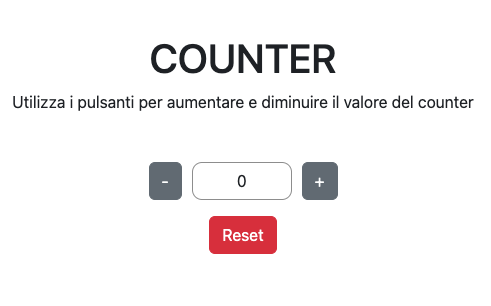

<h3 align="center">Counter</h3>

  

  

    In questo progetto ho sviluppato un semplice counter con due bottoni che ti permettono di decrementare e incrementare il valore del counter.
  

<!-- USAGE EXAMPLES -->
## Usage

È possibile utilizzare il counter tramite il seguente link: [https://counter-niccoloruberti.netlify.app/]

<!-- CONTACT -->
## Contact

niccoloruberti1999@gmail.com

Profilo LinkedIn: [https://www.linkedin.com/in/niccoló-ruberti-637b56290/]

Project Link: [https://github.com/niccoloruberti/Counter]